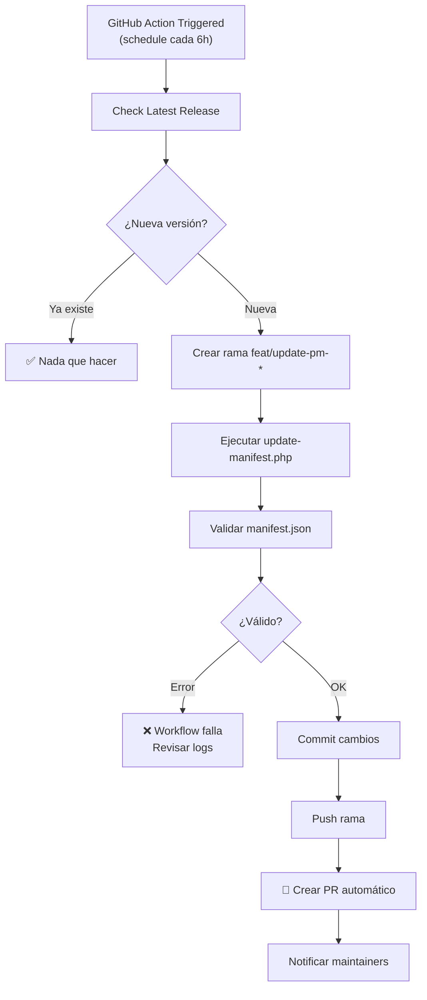

# 🤖 Configuración de GitHub Actions - Auto-Update Manifest

## Descripción General

El workflow `update.yml` ahora automatiza **completamente** el proceso de detectar nuevas versiones de PocketMine-MP y actualizar el `manifest.json` con un Pull Request automático.

### ¿Qué hace?

1. **Detecta nuevas versiones** de PocketMine-MP cada 6 horas (o manualmente)
2. **Descarga y verifica** los artefactos (PocketMine PHAR + PHP binaries)
3. **Calcula SHA256 checksums** automáticamente
4. **Actualiza manifest.json** con toda la información
5. **Valida** que el manifest sea correcto (strict mode)
6. **Crea un PR** automáticamente en la rama `main`

---

## 🚀 Flujo de Trabajo



---

## ⚙️ Configuración Requerida

### 1. **Permisos del Workflow**

El workflow necesita permisos para:
- ✅ `contents: write` — Crear ramas y commits
- ✅ `pull-requests: write` — Crear PRs
- ✅ `issues: write` — Comentar en issues

**Estado actual**: ✅ Ya configurado en `update.yml`

```yaml
permissions:
  contents: write
  issues: write
  pull-requests: write
```

### 2. **Configuración de Ramas (Branch Protection)**

Se recomienda proteger la rama `main`:

1. Ve a **Settings → Branches → Add rule**
2. Aplica a: `main`
3. Requisitos:
   - [x] Require a pull request before merging
   - [x] Require status checks to pass (si tienes validate.yml)
   - [x] Require branches to be up to date

Esto garantiza que los PRs automáticos pasen validaciones antes de mergear.

### 3. **Variables de Entorno (Opcional)**

Si necesitas customizar comportamiento, puedes agregar secrets:

```bash
# En GitHub: Settings → Secrets and variables → Actions
# Ejemplo: (opcional, no es requerido para funcionamiento básico)
DISCORD_WEBHOOK=https://discord.com/...
SLACK_WEBHOOK=https://hooks.slack.com/...
```

---

## 📝 Cómo Usar

### Opción 1: Ejecución Automática (Scheduled)

El workflow se ejecuta **automáticamente cada 6 horas**:

```yaml
schedule:
  - cron: '0 */6 * * *'  # Cada 6 horas
```

Si hay una nueva versión, automáticamente:
1. ✅ Se detecta
2. ✅ Se actualiza manifest
3. ✅ Se crea un PR
4. ✅ Se notifica

### Opción 2: Ejecución Manual

Ve a **Actions → Check New PocketMine-MP Releases** y haz click en **"Run workflow"**

Puedes opcionalmente:
- **force_version**: Fuerza una versión específica (ej: `5.43.1`)
- **auto_pr**: Crear PR automáticamente (default: `true`)

```bash
# Ejemplo manual:
# Actions → Run workflow → force_version: "5.43.1"
```

---

## 📊 Qué Sucede Cuando se Crea un PR

### 1. **Rama**
```
feat/update-pm-5431  (ejemplo para versión 5.43.1)
```

### 2. **Commit Message**
```
feat: add PocketMine-MP 5.43.1

- Auto-update via GitHub Actions
- PHP version auto-detected from build_info.json
- SHA256 checksums verified
- MC version: 1.21.0
```

### 3. **PR Details**

```markdown
## 🚀 Automated Version Update

### 📋 Details
| Field | Value |
|-------|-------|
| **Version** | `5.43.1` |
| **MC Version** | `1.21.0` |
| **API Version** | `5.43.0` |
| **PHP Version** | `8.2.x` |
| **Release Date** | `2024-XX-XX` |

### ✅ Automated Checks
- [x] `update-manifest.php` executed successfully
- [x] `validate-manifest.php` passed (strict mode)
- [x] SHA256 checksums verified
- [x] Build info extracted from GitHub releases

### 📦 Artifacts Downloaded & Verified
- PocketMine-MP PHAR (all 5 platforms)
- PHP binaries (recommended version)
- All checksums computed and validated

### 🔍 Review Checklist
- [ ] Verify MC/API versions are correct
- [ ] Check if stubs need updating
- [ ] Validate against official changelog
```

### 4. **Validaciones Que Se Ejecutan**

Automáticamente antes de crear el PR:

```bash
# 1. Ejecuta update-manifest.php
php scripts/update-manifest.php --version=5.43.1 --mc-version=1.21.0

# 2. Valida con strict mode
php scripts/validate-manifest.php --strict

# 3. Pushea rama y crea PR
git push origin feat/update-pm-5431
hub pull-request ...
```

---

## 🔍 Monitoreo y Debugging

### Ver Logs del Workflow

1. Ve a **Actions** en tu repositorio
2. Selecciona el workflow "Check New PocketMine-MP Releases"
3. Haz click en la última ejecución
4. Expande los pasos para ver logs detallados

### Tipos de Salida

```
✓ Usando versión forzada: 5.43.1
✓ Último release en GitHub: 5.43.1
✓ Versión 5.43.1 ya está en manifest
⚠ Versión 5.43.1 NO está en manifest - se actualizará
✓ Versión Minecraft detectada: 1.21.0
```

### Si Algo Falla

El workflow genera logs detallados. Busca:

1. **Error en update-manifest.php**
   - Verifica descargas de artefactos
   - Comprueba checksums
   - Revisa permisos de red

2. **Error en validate-manifest.php**
   - El manifest.json tiene estructura inválida
   - Faltan campos requeridos
   - Checksums incorrectos

3. **Error al crear PR**
   - Verifica permisos de `contents: write`
   - Comprueba si la rama ya existe
   - Revisa la conexión a GitHub API

### Comando para Ejecutar Localmente

Para reproducir lo que hace el workflow:

```bash
# 1. Crear rama
git checkout -b feat/update-pm-5431

# 2. Actualizar manifest
php scripts/update-manifest.php \
  --version=5.43.1 \
  --mc-version=1.21.0

# 3. Validar
php scripts/validate-manifest.php --strict

# 4. Commit
git add manifest.json
git commit -m "feat: add PocketMine-MP 5.43.1"

# 5. Push
git push origin feat/update-pm-5431

# Luego crear PR manualmente o con gh CLI:
gh pr create \
  --title "🎉 Update: Add PocketMine-MP 5.43.1" \
  --base main \
  --body "$(cat pr_template.md)"
```

---

## 🎯 Checklist de Implementación

Para activar completamente el sistema:

- [x] ✅ Workflow `update.yml` creado con ambos jobs (check + auto-update)
- [x] ✅ Permisos necesarios configurados
- [x] ✅ PHP 8.2 setup en runner
- [ ] ⚠️ **Verificar** que los scripts `update-manifest.php` y `validate-manifest.php` existen
- [ ] ⚠️ **Revisar** que el archivo `manifest.json` tiene estructura válida
- [ ] ⚠️ **Probar** manualmente con `workflow_dispatch` (run workflow):
  - [ ] Forzar una versión conocida
  - [ ] Verificar que se crea la rama
  - [ ] Verificar que se crea el PR
  - [ ] Revisar que el manifest está correcto
- [ ] ✅ Configurar branch protection en `main` (recomendado)
- [ ] ✅ Agregar labels a issues automáticas (opcional)

---

## 🚨 Consideraciones Importantes

### Seguridad

- ✅ El workflow usa `github-actions[bot]` (cuenta de sistema)
- ✅ Solo escribe en ramas nuevas, no en `main` directamente
- ✅ Los PRs deben ser revisados antes de mergear
- ✅ Todos los artefactos se descargan de repos oficiales

### Performance

- ⏱️ El workflow tarda ~2-3 minutos en ejecutarse
- 📦 Descarga ~200MB (PocketMine + PHP binaries)
- 🌐 Requiere conexión a internet estable

### Limitaciones

- 📝 **Stubs checksum**: Aún requiere entrada manual
  - Solución: Ver `pocketmine-stubs` repo para obtener SHA256
- 🔄 Solo actúa cuando hay nueva versión en PocketMine-MP
- ⏸️ No crea PRs si la versión ya existe en manifest

---

## 📚 Recursos Relacionados

- **Scripts principales**:
  - `scripts/update-manifest.php` — Descarga y actualiza
  - `scripts/validate-manifest.php` — Valida estructura

- **Documentación**:
  - `README.md` — Guía general
  - `MANIFEST_SCRIPTS.md` — Detalles de scripts

- **Configuración**:
  - `.github/workflow/update.yml` — Este workflow
  - `.github/workflow/validate.yml` — Validación en cada PR

---

## ✉️ Notificaciones Futuras

El sistema está listo para agregar notificaciones a:

- 📧 Email a maintainers
- 💬 Slack/Discord webhooks
- 📱 Push notifications
- 📝 Comentarios automáticos en PRs

Para agregar, modifica el step final del workflow.

---

## 🤝 Contribuciones

Si encuentras bugs o tienes mejoras:

1. Abre un issue describiendo el problema
2. Haz un PR con cambios propuestos
3. Incluye logs si es relacionado con el workflow

---

**Última actualización**: 2024  
**Versión**: 1.0 (Automated)
