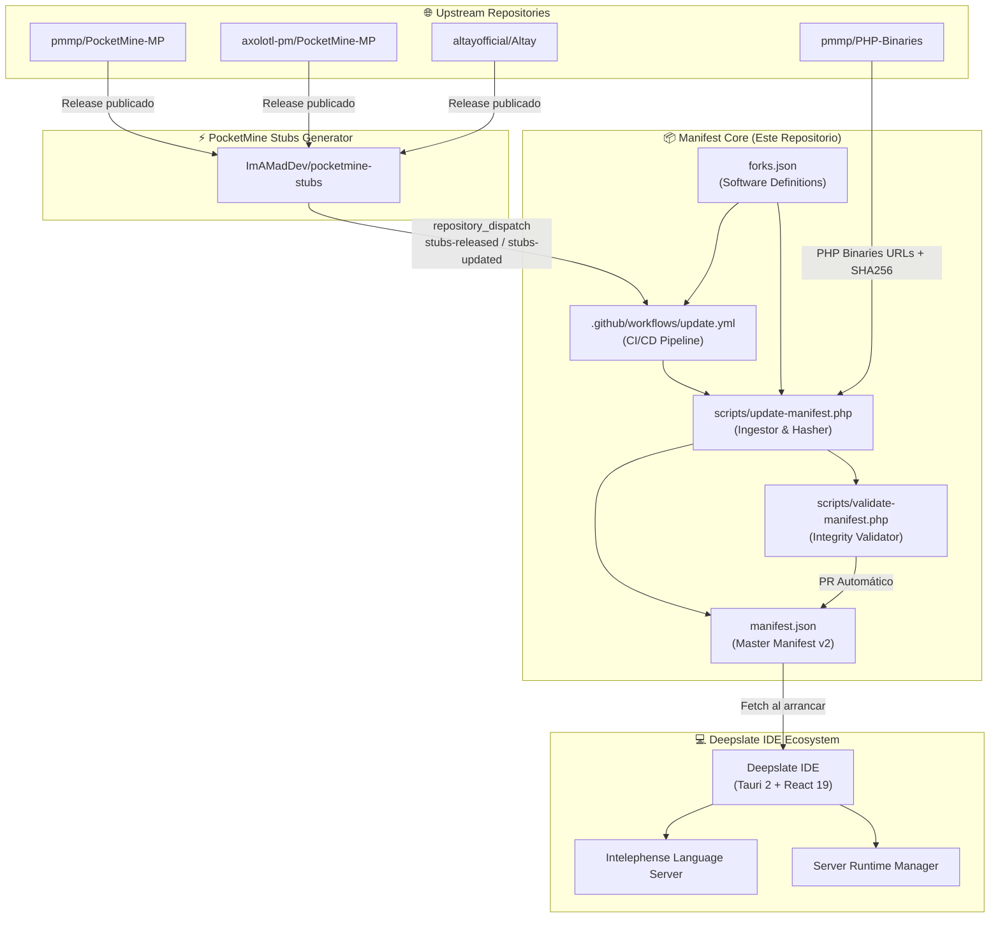
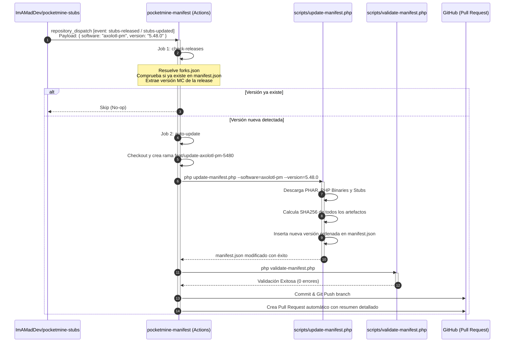

# 🏛️ Deepslate — Arquitectura de `pocketmine-manifest`

Documentación técnica y de diseño arquitectónico de [`pocketmine-manifest`](https://github.com/ImAMadDev/pocketmine-manifest), el registro maestro y motor de resolución de versiones para **PocketMine-MP y sus forks** dentro del ecosistema **Deepslate**.

---

## 📑 Tabla de Contenidos

1. [Visión General y Rol en el Ecosistema](#1-visión-general-y-rol-en-el-ecosistema)
2. [Principios de Diseño](#2-principios-de-diseño)
3. [Modelos de Datos y Esquemas JSON](#3-modelos-de-datos-y-esquemas-json)
   - [3.1. `manifest.json` (Esquema v2)](#31-manifestjson-esquema-v2)
   - [3.2. `forks.json` (Configuración de Softwares)](#32-forksjson-configuración-de-softwares)
4. [Flujo y Arquitectura de Automatización (CI/CD)](#4-flujo-y-arquitectura-de-automatización-cicd)
   - [4.1. Ciclo de Vida Event-Driven (`repository_dispatch`)](#41-ciclo-de-vida-event-driven-repository_dispatch)
   - [4.2. Workflow: `update.yml`](#42-workflow-updateyml)
   - [4.3. Workflow: `validate.yml`](#43-workflow-validateyml)
5. [Herramientas CLI y Scripts de Mantenimiento](#5-herramientas-cli-y-scripts-de-mantenimiento)
   - [5.1. `update-manifest.php`](#51-update-manifestphp)
   - [5.2. `validate-manifest.php`](#52-validate-manifestphp)
   - [5.3. `fetch_releases.py`](#53-fetch_releasespy)
6. [Seguridad e Integridad Criptográfica](#6-seguridad-e-integridad-criptográfica)
7. [Guía de Extensión: Agregar un Nuevo Fork](#7-guía-de-extensión-agregar-un-nuevo-fork)
8. [Estructura del Proyecto](#8-estructura-del-proyecto)
9. [Diagnóstico y Resolución de Problemas](#9-diagnóstico-y-resolución-de-problemas)

---

## 1. Visión General y Rol en el Ecosistema

El proyecto **`pocketmine-manifest`** actúa como la **fuente única de verdad (Single Source of Truth)** para el IDE **Deepslate** y sus herramientas asociadas. Proporciona un índice centralizado y validado de todas las versiones publicadas de servidores Bedrock basados en PocketMine-MP (incluyendo forks como Axolotl-PM, Altay, etc.), sus binarios de ejecución PHP multiplataforma, y los stubs PHP para autocompletado y análisis estático.



---

## 2. Principios de Diseño

1. **Inmutabilidad y Cero Confianza (Zero-Trust Artifacts):**
   Todos los binarios (`.phar`, `.tar.gz`, `.zip`) cuentan con un hash criptográfico **SHA256** calculado directamente al momento de la ingesta. El cliente Deepslate nunca ejecuta ni extrae ningún archivo sin verificar su suma de control.
2. **Arquitectura Agnóstica Multi-Software:**
   El sistema no asume nombres de repositorio ni rutas fijas. Todo el comportamiento de PocketMine-MP y sus forks está desacoplado y parametrizado a través de [`forks.json`](file:///home/luq/Github%20Projects/pocketmine-manifest/forks.json).
3. **Pipeline 100% Guiado por Eventos (Event-Driven):**
   La sincronización no depende de sondeos periódicos innecesarios (*polling*), sino de eventos `repository_dispatch` emitidos por el generador de stubs (`pocketmine-stubs`) en tiempo real cuando un release está listo.
4. **Validación Estricta Pre-Merge:**
   Ningún cambio en [`manifest.json`](file:///home/luq/Github%20Projects/pocketmine-manifest/manifest.json) puede integrarse sin pasar una suite exhaustiva de comprobación semántica, detección de placeholders y validación de tipos.

---

## 3. Modelos de Datos y Esquemas JSON

### 3.1. `manifest.json` (Esquema v2)

[`manifest.json`](file:///home/luq/Github%20Projects/pocketmine-manifest/manifest.json) es el archivo maestro servido mediante CDN o raw GitHub.

```jsonc
{
  "$schema": "https://json-schema.org/draft/2020-12/schema",
  "manifest_version": 2,
  "updated_at": "2026-08-31T18:00:00Z",
  "softwares": {
    "pocketmine": {
      "name": "PocketMine-MP",
      "repo": "pmmp/PocketMine-MP",
      "description": "Official PocketMine-MP server software"
    },
    "axolotl-pm": {
      "name": "Axolotl-PM",
      "repo": "axolotl-pm/PocketMine-MP",
      "description": "High-performance PocketMine-MP fork"
    },
    "altay": {
      "name": "Altay",
      "repo": "altayofficial/Altay",
      "description": "Altay PocketMine-MP fork"
    }
  },
  "versions": [
    {
      "id": "5.44.3",
      "software": "pocketmine",
      "api_version": "5.44.0",
      "release_date": "2026-08-05",
      "stability": "stable",
      "minecraft_version": "1.26.30",
      "min_php": "8.2",
      "php_binary_tag": "pm5-php-8.2-latest",
      "changelog_url": "https://github.com/pmmp/PocketMine-MP/releases/download/5.44.3/changelogs/5.44.md",
      "downloads": {
        "server_phar": "https://github.com/pmmp/PocketMine-MP/releases/download/5.44.3/PocketMine-MP.phar",
        "server_phar_sha256": "d8b4d87a64124d83659f629c87d6a8e0e142192f6c719fe4684272ff44105539",
        "pocketmine_phar": "https://github.com/pmmp/PocketMine-MP/releases/download/5.44.3/PocketMine-MP.phar",
        "pocketmine_phar_sha256": "d8b4d87a64124d83659f629c87d6a8e0e142192f6c719fe4684272ff44105539",
        "php_windows_x64": "https://github.com/pmmp/PHP-Binaries/releases/download/pm5-php-8.2-latest/PHP-8.2-Windows-x64-PM5.zip",
        "php_windows_x64_sha256": "c9ca8505da43977d431267ffa782a7b5b077fca068ae2a9da81271c62ef18ba9",
        "php_linux_x86_64": "https://github.com/pmmp/PHP-Binaries/releases/download/pm5-php-8.2-latest/PHP-8.2-Linux-x86_64-PM5.tar.gz",
        "php_linux_x86_64_sha256": "000fc605878d24be3d6faa6991c0d3a39ae90a0f9ff24d9f4e4722ef823082fc",
        "php_macos_x86_64": "https://github.com/pmmp/PHP-Binaries/releases/download/pm5-php-8.2-latest/PHP-8.2-MacOS-x86_64-PM5.tar.gz",
        "php_macos_x86_64_sha256": "bca5c269f329a4f763719eb19772509373af1a6122a215bce4aa4c95e2743888",
        "php_macos_arm64": "https://github.com/pmmp/PHP-Binaries/releases/download/pm5-php-8.2-latest/PHP-8.2-MacOS-arm64-PM5.tar.gz",
        "php_macos_arm64_sha256": "eae469f7f7843b718e53021bbcc6a1a18f91b617cf7895a8cf8985451a66c8e6"
      },
      "stubs": {
        "url": "https://github.com/ImAMadDev/pocketmine-stubs/releases/download/5.44.3/stubs-5.44.3.zip",
        "checksum_sha256": "6f6486086dacdf6c91596f1bde9bdfc2db4ccd1d53a343e7f18275b362444178"
      }
    }
  ]
}
```

#### Diccionario de Datos (`versions[]`)

| Campo | Tipo | Requerido | Descripción |
| :--- | :--- | :--- | :--- |
| `id` | `string` | **Sí** | Versión semántica del software (ej: `5.44.3`). |
| `software` | `string` | **Sí** | Identificador del fork (`pocketmine`, `axolotl-pm`, `altay`). Clave foránea a `softwares`. |
| `api_version` | `string` | **Sí** | Versión de la API expuesta a plugins (ej: `5.44.0`). |
| `release_date` | `string` | **Sí** | Fecha de publicación en formato `YYYY-MM-DD`. |
| `stability` | `string` | **Sí** | Estabilidad: `stable`, `beta`, `alpha`, o `rc`. |
| `minecraft_version` | `string` | **Sí** | Versión de Minecraft Bedrock soportada (ej: `1.26.30`). |
| `min_php` | `string` | **Sí** | Versión mínima de PHP requerida (ej: `8.2`, `8.3`). |
| `php_binary_tag` | `string` | **Sí** | Tag de los binarios precompilados de PMMP. |
| `changelog_url` | `string` | No | URL al changelog de la versión. |
| `downloads` | `object` | **Sí** | Mapa con URLs de descarga y sus respectivos hashes `*_sha256`. |
| `downloads.server_phar` | `string` | **Sí** | URL canónica de descarga del PHAR ejecutable. |
| `downloads.server_phar_sha256` | `string` | **Sí** | Checksum SHA256 (64 hex) del PHAR. |
| `downloads.php_*` | `string` | **Sí** | URLs y hashes de los runtimes PHP para Windows, Linux y macOS. |
| `stubs.url` | `string` | **Sí** | URL al archivo ZIP con los stubs PHPStorm / Intelephense. |
| `stubs.checksum_sha256` | `string` | **Sí** | Checksum SHA256 del paquete de stubs. |

> [!IMPORTANT]
> **Clave Primaria Compuesta:** La unicidad de cada entrada en `versions` está determinada por el par `(software, id)`. Pueden coexistir la versión `5.44.0` de `pocketmine` y la `5.44.0` de `axolotl-pm` o `altay`.

---

### 3.2. `forks.json` (Configuración de Softwares)

[`forks.json`](file:///home/luq/Github%20Projects/pocketmine-manifest/forks.json) define las reglas de construcción de URLs, prefijos de tags y repositorios de cada software:

```json
{
  "$schema": "https://json-schema.org/draft/2020-12/schema",
  "forks": {
    "pocketmine": {
      "name": "PocketMine-MP",
      "repo": "pmmp/PocketMine-MP",
      "type": "phar",
      "phar_url_template": "https://github.com/pmmp/PocketMine-MP/releases/download/{version}/PocketMine-MP.phar",
      "phar_latest_url": "https://github.com/pmmp/PocketMine-MP/releases/latest/download/PocketMine-MP.phar",
      "source_url_template": "https://github.com/pmmp/PocketMine-MP/archive/refs/tags/{version}.zip",
      "phar_name": "PocketMine-MP.phar",
      "tag_prefix": "",
      "stubs_tag_prefix": "",
      "release_name_template": "Stubs PocketMine-MP {version}",
      "description": "Official PocketMine-MP server software"
    },
    "axolotl-pm": {
      "name": "Axolotl-PM",
      "repo": "axolotl-pm/PocketMine-MP",
      "type": "phar",
      "phar_url_template": "https://github.com/axolotl-pm/PocketMine-MP/releases/download/{version}/PocketMine-MP.phar",
      "phar_latest_url": "https://github.com/axolotl-pm/PocketMine-MP/releases/latest/download/PocketMine-MP.phar",
      "source_url_template": "https://github.com/axolotl-pm/PocketMine-MP/archive/refs/tags/{version}.zip",
      "phar_name": "PocketMine-MP.phar",
      "tag_prefix": "axolotl-",
      "stubs_tag_prefix": "axolotl-",
      "release_name_template": "Stubs Axolotl-PM {version}",
      "description": "High-performance PocketMine-MP fork"
    },
    "altay": {
      "name": "Altay",
      "repo": "altayofficial/Altay",
      "type": "phar",
      "phar_url_template": "https://github.com/altayofficial/Altay/releases/download/{version}/Altay.phar",
      "phar_latest_url": "https://github.com/altayofficial/Altay/releases/latest/download/Altay.phar",
      "source_url_template": "https://github.com/altayofficial/Altay/archive/refs/tags/{version}.zip",
      "phar_name": "Altay.phar",
      "tag_prefix": "altay-",
      "stubs_tag_prefix": "altay-",
      "release_name_template": "Stubs Altay {version}",
      "description": "Altay PocketMine-MP fork"
    }
  }
}
```

---

## 4. Flujo y Arquitectura de Automatización (CI/CD)

### 4.1. Ciclo de Vida Event-Driven (`repository_dispatch`)

El flujo de actualización está completamente desacoplado y automatizado de extremo a extremo:



---

### 4.2. Workflow: `update.yml`

Ubicación: [`.github/workflows/update.yml`](file:///home/luq/Github%20Projects/pocketmine-manifest/.github/workflows/update.yml)

#### Triggers configurados:
```yaml
on:
  workflow_dispatch:
    inputs:
      software:
        description: "Software o Fork ('pocketmine', 'axolotl-pm', 'altay')"
        required: false
        type: string
        default: "pocketmine"
      force_version:
        description: "Forzar verificación de una versión específica (ej: 5.44.3)"
        required: false
        type: string
      auto_pr:
        description: "Crear PR automáticamente si se detecta versión nueva"
        required: false
        type: boolean
        default: true
  repository_dispatch:
    types: [stubs-released, stubs-updated]
```

#### Trabajos (*Jobs*):
1. **`check-releases`**:
   - Resuelve el software y el repositorio destino leyendo `forks.json` dinámicamente con `jq`.
   - Consulta el release mediante la API REST de GitHub (limpiando prefijos como `axolotl-` o `altay-`).
   - Verifica si la tupla `(software, version)` ya existe en `manifest.json`.
   - Extrae metadatos como la versión de Bedrock Minecraft del changelog.
2. **`auto-update`** (condicional: `needs_update == 'true'`):
   - Crea una rama temporal `feat/update-<software>-<version>`.
   - Ejecuta `php scripts/update-manifest.php`.
   - Valida el archivo resultante con `php scripts/validate-manifest.php`.
   - Realiza commit y crea un Pull Request enriquecido con formato Markdown mediante `actions/github-script@v7`.

---

### 4.3. Workflow: `validate.yml`

Ubicación: [`.github/workflows/validate.yml`](file:///home/luq/Github%20Projects/pocketmine-manifest/.github/workflows/validate.yml)

Se activa en cada `push` o `pull_request` que modifique `manifest.json`:
1. Comprueba la sintaxis pura de JSON.
2. Ejecuta `php scripts/validate-manifest.php`.
3. Comprueba que no existan cadenas placeholder como `NEEDS_SHA256_COMPUTE` o `NEEDS_MANUAL_FILL`.

---

## 5. Herramientas CLI y Scripts de Mantenimiento

### 5.1. `update-manifest.php`

Ubicación: [`scripts/update-manifest.php`](file:///home/luq/Github%20Projects/pocketmine-manifest/scripts/update-manifest.php)

Motor central en PHP 8.2+ para la descarga, hashing y actualización de `manifest.json`.

```bash
# Ejemplo: Ingesta de versión estándar de PocketMine-MP
php scripts/update-manifest.php --version=5.44.3

# Ejemplo: Ingesta de un Fork (Axolotl-PM)
php scripts/update-manifest.php --software=axolotl-pm --version=5.48.0

# Simulación (dry-run) sin alterar manifest.json
php scripts/update-manifest.php --software=altay --version=5.44.4 --dry-run
```

#### Parámetros soportados:

| Parámetro | Default | Descripción |
| :--- | :--- | :--- |
| `--version=X.Y.Z` | *(Requerido)* | Versión semántica del release a incorporar. |
| `--software=NAME` | `pocketmine` | Clave del software registrada en `forks.json`. |
| `--mc-version=X.Y.Z` | Auto | Sobreescribe la versión detectada de Minecraft. |
| `--api-version=X.Y.Z` | Auto | Sobreescribe la versión de API detectada. |
| `--min-php=X.Y` | `8.2` | Versión mínima de PHP requerida. |
| `--phar-url=URL` | Auto | URL directa personalizada al archivo PHAR. |
| `--dry-run` | `false` | Ejecuta todo el cálculo e imprime el JSON sin escribir a disco. |
| `-f`, `--force` | `false` | Sobreescribe la versión si ya existe en `manifest.json`. |

#### Mecánica de Hashing:
El script descarga los archivos en chunks de 1 MB (`CHUNK_SIZE = 1048576`) utilizando contextos de streaming cURL para optimizar el consumo de memoria RAM y calcula el hash `sha256` en tiempo real.

---

### 5.2. `validate-manifest.php`

Ubicación: [`scripts/validate-manifest.php`](file:///home/luq/Github%20Projects/pocketmine-manifest/scripts/validate-manifest.php)

Suite de validación de integridad y consistencia del manifest.

```bash
# Validación estándar local y en CI
php scripts/validate-manifest.php

# Validar conectividad de todas las URLs (HTTP HEAD requests)
php scripts/validate-manifest.php --check-urls

# Verificación exhaustiva: Descargar todos los binarios y re-calcular SHA256
php scripts/validate-manifest.php --verify-checksums

# Modo estricto (falla con código != 0 ante cualquier advertencia)
php scripts/validate-manifest.php --strict
```

#### Reglas evaluadas:
- [x] Sintaxis JSON válida y estructura de objeto raíz.
- [x] Presencia de campos requeridos (`manifest_version`, `updated_at`, `softwares`, `versions`).
- [x] Software registrado en `forks.json` o sección `softwares`.
- [x] Unicidad de la clave compuesta `(software, id)`.
- [x] Formato de versión SemVer (`X.Y.Z`).
- [x] Validez de formato hexadecimal de 64 caracteres en todos los campos `*_sha256`.
- [x] Ausencia de placeholders (`NEEDS_*`).
- [x] Estabilidad dentro de `['stable', 'beta', 'alpha', 'rc']`.
- [x] Fechas en formato ISO 8601 `YYYY-MM-DD`.

---

### 5.3. `fetch_releases.py`

Ubicación: [`scripts/fetch_releases.py`](file:///home/luq/Github%20Projects/pocketmine-manifest/scripts/fetch_releases.py)

Script en Python 3 para sincronización histórica o masiva de releases desde GitHub API:

```bash
# Sincronizar todos los releases históricos de todos los forks
python3 scripts/fetch_releases.py --software=all --token=ghp_xxxx

# Ejecución concurrente multihilo para alta velocidad
python3 scripts/fetch_releases.py --software=all --parallel --max-workers=4 --token=ghp_xxxx
```

---

## 6. Seguridad e Integridad Criptográfica

Para proteger a los usuarios de **Deepslate IDE** contra ataques de intermediario (*Man-In-The-Middle*), compromiso de servidores de artefactos o descargas corruptas:

1. **Sumas de control SHA256 obligatorias:** Cada archivo distribuido (`PocketMine-MP.phar`, `Altay.phar`, PHP binaries para Windows, Linux y macOS, y stubs ZIP) posee su hash en el manifest.
2. **Validación en Cliente:** El IDE Deepslate descarga el artefacto y calcula `crypto.subtle.digest("SHA-256", buffer)` antes de montarlo o ejecutarlo. Si el hash difiere, la ejecución se aborta.
3. **Mínimo Privilegio en CI:** El workflow de GitHub Actions opera con permisos acotados (`contents: write`, `pull-requests: write`) y nunca commitea directamente a `main`, sino que abre Pull Requests que deben pasar el workflow `validate.yml`.

---

## 7. Guía de Extensión: Agregar un Nuevo Fork

Para agregar soporte para un nuevo fork de PocketMine-MP (por ejemplo `example-pm`):

### Paso 1: Registrar en `forks.json`
Edita [`forks.json`](file:///home/luq/Github%20Projects/pocketmine-manifest/forks.json) y añade la configuración del fork:

```json
{
  "forks": {
    "example-pm": {
      "name": "Example-PM",
      "repo": "example-org/Example-PM",
      "type": "phar",
      "phar_url_template": "https://github.com/example-org/Example-PM/releases/download/{version}/Example-PM.phar",
      "phar_latest_url": "https://github.com/example-org/Example-PM/releases/latest/download/Example-PM.phar",
      "source_url_template": "https://github.com/example-org/Example-PM/archive/refs/tags/{version}.zip",
      "phar_name": "Example-PM.phar",
      "tag_prefix": "example-",
      "stubs_tag_prefix": "example-",
      "release_name_template": "Stubs Example-PM {version}",
      "description": "High performance Example fork"
    }
  }
}
```

### Paso 2: Registrar en `manifest.json` (`softwares`)
Agrega la metadata del software en la sección `"softwares"` de [`manifest.json`](file:///home/luq/Github%20Projects/pocketmine-manifest/manifest.json):

```json
"example-pm": {
  "name": "Example-PM",
  "repo": "example-org/Example-PM",
  "description": "High performance Example fork"
}
```

### Paso 3: Generar la versión en el manifest
Ejecuta el script localmente o dispara el workflow manual:

```bash
php scripts/update-manifest.php --software=example-pm --version=1.0.0
php scripts/validate-manifest.php
```

---

## 8. Estructura del Proyecto

```
pocketmine-manifest/
├── .github/
│   └── workflows/
│       ├── update.yml              # Pipeline CI/CD: Dispatch trigger & auto-PR
│       └── validate.yml            # Pipeline CI/CD: Validación estricta en PR/push
├── scripts/
│   ├── fetch_releases.py           # Sincronizador histórico masivo (Python multithreaded)
│   ├── update-manifest.php         # Ingestor, hasher SHA256 y actualizador del manifest
│   └── validate-manifest.php       # Validador de esquemas, integridad y checksums
├── forks.json                      # Registro y configuración central de forks y softwares
├── manifest.json                   # Registro maestro v2 consumido por Deepslate IDE
├── MANIFEST_ARCHITECTURE.md        # Documento de arquitectura técnica (este archivo)
└── README.md                       # Documentación rápida y guía de uso
```

---

## 9. Diagnóstico y Resolución de Problemas

### 1. Placeholders en `manifest.json`
* **Síntoma:** El workflow `validate.yml` emite un error con `NEEDS_SHA256_COMPUTE` o `NEEDS_MANUAL_FILL`.
* **Causa:** Alguna versión fue agregada manualmente sin calcular los hashes o faltó la versión de Minecraft.
* **Solución:** Ejecuta `php scripts/update-manifest.php --software=<software> --version=<version> -f` para recalcular los hashes automáticamente.

### 2. GitHub API Rate Limit (HTTP 403)
* **Síntoma:** `fetch_releases.py` o `update-manifest.php` fallan con error HTTP 403.
* **Causa:** Se superó el límite de peticiones anónimas a la API de GitHub (60 peticiones/hora).
* **Solución:** Proporciona un token con permisos de lectura pública:
  ```bash
  python3 scripts/fetch_releases.py --software=all --token=ghp_TU_TOKEN
  ```

### 3. Falla al resolver el archivo PHAR
* **Síntoma:** `update-manifest.php` no encuentra el archivo `.phar` para un tag específico.
* **Causa:** El release de GitHub usa un nombre de asset diferente o el tag tiene un prefijo no registrado.
* **Solución:** Revisa `tag_prefix` y `phar_name` en [`forks.json`](file:///home/luq/Github%20Projects/pocketmine-manifest/forks.json), o usa la opción `--phar-url="https://..."` para forzar la URL del asset.

---
*Deepslate Ecosystem — ImAMadDev/pocketmine-manifest*
