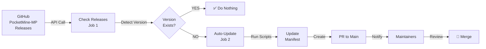

# 🎯 Flujo Visual Automatizado - PocketMine Manifest Manager

## 📊 Arquitectura General



---

## 🔄 Flujo Completo - Step by Step

### FASE 1: CHECK RELEASES JOB

```
┌─────────────────────────────────────────────────────┐
│         CHECK-RELEASES JOB (5 minutos)              │
└─────────────────────────────────────────────────────┘

1. CHECKOUT
   └─ Clona el repositorio
      └─ Obtiene manifest.json actual

2. SETUP PHP
   └─ Configura PHP 8.2
      └─ Extensiones: curl, json, zip

3. GET LATEST RELEASE
   └─ curl GitHub API
      └─ https://api.github.com/repos/pmmp/PocketMine-MP/releases/latest
         ├─ Opción A: force_version (manual) → usa versión forzada
         └─ Opción B: auto (scheduled)       → obtiene latest tag
      
      Salida: VERSION = "5.43.1"

4. CHECK IF EXISTS
   └─ jq '[.versions[].id] | contains(["5.43.1"])' manifest.json
      ├─ true  → EXISTS = true  → ✅ FIN (nada que hacer)
      └─ false → EXISTS = false → 🚀 Procede a auto-update
      
      Output: needs_update = true/false

5. GET RELEASE DETAILS (solo si no existe)
   └─ Obtiene release info
      ├─ MC Version: "1.21.0"
      ├─ Release Date: "2024-XX-XX"
      └─ Release Body: "..."
      
      Output: mc_version = "1.21.0"

OUTPUTS PARA JOB 2:
  ├─ version = "5.43.1"
  ├─ needs_update = true
  └─ mc_version = "1.21.0"
```

### FASE 2: AUTO-UPDATE JOB (Condicional - Solo si needs_update=true)

```
┌─────────────────────────────────────────────────────┐
│          AUTO-UPDATE JOB (8-10 minutos)             │
│     (Solo si Job 1 detectó nueva versión)          │
└─────────────────────────────────────────────────────┘

1. CHECKOUT CON FETCH DEPTH
   └─ git clone (fetch-depth: 0 para todo el historial)

2. SETUP PHP 8.2
   └─ Mismo setup que Job 1

3. CONFIGURE GIT
   └─ git config user.name "github-actions[bot]"
   └─ git config user.email "github-actions[bot]@users.noreply.github.com"

4. CREATE FEATURE BRANCH
   └─ VERSION="5.43.1"
   └─ BRANCH_NAME="feat/update-pm-5431"
   └─ git checkout -b "feat/update-pm-5431"

5. UPDATE MANIFEST (⭐ CORE)
   ┌──────────────────────────────────┐
   │ php scripts/update-manifest.php  │
   └──────────────────────────────────┘
   
   Acciones automáticas:
   ├─ Obtiene build_info.json de GitHub
   ├─ Auto-detecta:
   │  ├─ PHP version (ej: 8.2)
   │  ├─ API version (ej: 5.43.0)
   │  ├─ Minecraft version (ej: 1.21.0)
   │  └─ Build metadata
   │
   ├─ Descarga:
   │  ├─ PocketMine-MP PHAR (Linux, Windows, macOS, etc.)
   │  └─ PHP binaries recomendados
   │
   ├─ Calcula:
   │  ├─ SHA256 para cada archivo
   │  └─ Verifica integridad
   │
   └─ Actualiza manifest.json:
      ├─ Agrega nueva entrada de versión
      ├─ Asigna checksums
      └─ Mantiene estructura válida
   
   Salida:
   ✓ manifest.json actualizado
   ✓ Todos los checksums calculados
   ✓ Estructura validada

6. VALIDATE MANIFEST (⭐ QA)
   ┌──────────────────────────────────────┐
   │ php scripts/validate-manifest.php    │
   │         --strict                     │
   └──────────────────────────────────────┘
   
   Validaciones:
   ├─ Estructura JSON válida
   ├─ Campos requeridos presentes
   ├─ Formatos de checksum correcto
   ├─ URLs válidas (opcional)
   ├─ Checksums verificables
   └─ Sin entradas "NEEDS_*"
   
   Si falla: ❌ Workflow detiene
   Si pasa:  ✅ Continúa

7. COMMIT CHANGES
   └─ git add manifest.json
   └─ git commit -m "feat: add PocketMine-MP 5.43.1
                      
                      - Auto-update via GitHub Actions
                      - PHP version auto-detected from build_info.json
                      - SHA256 checksums verified
                      - MC version: 1.21.0"

8. PUSH BRANCH & CREATE PR
   ┌──────────────────────────────────┐
   │    github-script JavaScript      │
   └──────────────────────────────────┘
   
   Acciones:
   ├─ git push origin feat/update-pm-5431
   ├─ Obtiene datos del manifest.json actualizado
   ├─ Crea PR hacia main:
   │
   │  Title: "🎉 Update: Add PocketMine-MP 5.43.1"
   │  
   │  Body:
   │  ┌────────────────────────────────────────┐
   │  │ ## 🚀 Automated Version Update        │
   │  │                                        │
   │  │ ### 📋 Details                        │
   │  │ | Field | Value |                    │
   │  │ |-------|-------|                    │
   │  │ | Version | 5.43.1 |                │
   │  │ | MC Version | 1.21.0 |             │
   │  │ | API Version | 5.43.0 |            │
   │  │ | PHP Version | 8.2.x |             │
   │  │ | Release Date | 2024-XX-XX |       │
   │  │                                        │
   │  │ ### ✅ Automated Checks              │
   │  │ - [x] update-manifest.php OK         │
   │  │ - [x] validate-manifest.php OK       │
   │  │ - [x] SHA256 checksums OK            │
   │  │ - [x] Build info extracted OK        │
   │  │                                        │
   │  │ ### 🔍 Review Checklist              │
   │  │ - [ ] Verify MC/API versions         │
   │  │ - [ ] Check if stubs updated         │
   │  │ - [ ] Validate against changelog     │
   │  └────────────────────────────────────────┘
   │
   └─ Labels: automated, version-update
   └─ PR creado automáticamente ✅

9. COMMENT ON RELATED ISSUES (Opcional)
   └─ Busca issues con label "new-version"
   └─ Comenta en issues que coincidan con versión
   └─ Notifica: "PR automático creado para esta versión"

10. PRINT SUMMARY
    └─ Resumen en logs:
       ├─ Version: 5.43.1
       ├─ MC Version: 1.21.0
       ├─ Branch: feat/update-pm-5431
       ├─ Status: ✅ Auto-update completed successfully
       └─ Action: PR will be reviewed by maintainers
```

---

## ⏱️ Timeline Completo

```
TIME    EVENT                                      STATUS
────────────────────────────────────────────────────────────
00:00   Workflow triggered (scheduled)             🟢 START

CHECK-RELEASES JOB
00:05   Setup environment                          ✅ OK
00:10   Fetch latest PocketMine release (5.43.1)  ✅ OK
00:15   Check if 5.43.1 in manifest               ✅ NO (new!)
00:20   Get release details (MC version, etc)     ✅ OK

AUTO-UPDATE JOB (Triggered by outputs from Job 1)
00:25   Setup environment                          ✅ OK
00:30   Create feature branch                      ✅ OK
01:00   Download & extract PHAR + PHP binaries    ✅ OK (300MB)
02:30   Calculate SHA256 for all files            ✅ OK
03:00   Update manifest.json                       ✅ OK
03:30   Validate manifest                          ✅ OK
03:45   Commit changes                             ✅ OK
04:00   Push branch & create PR                    ✅ OK
04:15   Notify issues & print summary              ✅ OK

04:20   🎉 WORKFLOW COMPLETE
        PR ready for review at:
        https://github.com/user/repo/pull/123

NEXT STEPS
        Maintainer receives notification
        Reviews PR manually
        Checks manifest.json changes
        Merges if everything is correct
        ✅ Version available in production
```

---

## 🔀 Flujo de Control - Decisiones

```
START
 │
 ├─→ Scheduled? (every 6h)  ─→ YES ─→ Get latest version
 │                            NO
 ├─→ Manual trigger? (workflow_dispatch)
 │
 ├─→ Check manifest.json
 │
 └─→ ╔═══════════════════════════╗
     ║ ¿Version ya existe?       ║
     ╚═══════════════════════════╝
         │                 │
        YES               NO
         │                 │
         ├─→ ✅ DONE      │
         │   Nada         │
         │   que hacer    │
         │                └─→ ╔═══════════════════════════╗
         │                    ║ AUTO-UPDATE JOB           ║
         │                    ║ ───────────────────────   ║
         │                    ║ 1. Download artifacts     ║
         │                    ║ 2. Calculate checksums    ║
         │                    ║ 3. Update manifest.json   ║
         │                    ║ 4. Validate              ║
         │                    ║ 5. Create PR             ║
         │                    ╚═══════════════════════════╝
         │                         │
         │                    ┌─────┴─────┐
         │                    │           │
         │                   ✅          ❌
         │              PR Created    Validation
         │              to main       Failed
         │                │           │
         │                └─→ Logs    └─→ Workflow fails
         │                    PR       Maintainer
         │                    in       reviews logs
         │                    queue
         │
         └─→ END
```

---

## 🔌 Integración con GitHub

```
GITHUB ECOSYSTEM
├─ Releases (pmmp/PocketMine-MP)
│  └─ GitHub API → Obtiene build_info.json
│
├─ Actions (tu repo)
│  ├─ Job 1: check-releases
│  │  └─ Outputs → Job 2
│  │
│  └─ Job 2: auto-update
│     └─ Crea rama + commit + PR
│
├─ Pull Requests (tu repo/main)
│  └─ PR automático listo para review
│
├─ Issues (tu repo)
│  └─ Comentarios automáticos
│
└─ Notifications
   └─ Mantainers reciben:
      ├─ PR notification
      └─ Issue comment
```

---

## 📦 Descarga de Artefactos

```
update-manifest.php DESCARGAR:

1. PocketMine-MP PHAR
   ├─ Linux       (PocketMine-MP.phar)
   ├─ Windows     (PocketMine-MP.exe)
   ├─ macOS       (PocketMine-MP-Apple)
   ├─ macOS Intel (PocketMine-MP-MacOS-x86_64)
   └─ Generic     (PocketMine-MP-generic.phar)
   
   Fuente: https://github.com/pmmp/PocketMine-MP/releases/download/

2. PHP Binaries (Recomendado)
   └─ Detectado de build_info.json
   └─ Ejemplo: pm5-php-8.2-latest
   
   Fuente: https://github.com/pmmp/PHP-Binaries/releases/download/

CALCULAR SHA256:
   ├─ Streaming read (no se carga en memoria)
   ├─ Verifica integridad
   └─ Guarda en manifest.json
```

---

## 🎯 Validaciones en Cada Paso

```
STEP: Descarga
├─ ✅ Verifica HTTP status 200
├─ ✅ Verifica tamaño de archivo
├─ ✅ Reintenta en caso de error (max 3)
└─ ❌ Falla si no se puede descargar

STEP: SHA256
├─ ✅ Calcula correctamente
├─ ✅ Formato hexadecimal válido
└─ ❌ Falla si hay error de lectura

STEP: Manifest Update
├─ ✅ Estructura JSON válida
├─ ✅ Todos los campos requeridos
├─ ✅ No tiene "NEEDS_*" entries
└─ ❌ Falla si validation falla

STEP: PR Creation
├─ ✅ Rama se pushea correctamente
├─ ✅ PR se crea en GitHub
├─ ✅ Labels se agregan
└─ ❌ Falla si error de git/API
```

---

## 🔐 Seguridad y Límites

```
SEGURIDAD:
├─ ✅ github-actions[bot] creador de commits
├─ ✅ Solo crea ramas nuevas
├─ ✅ Nunca modifica main directamente
├─ ✅ PRs requieren review manual
├─ ✅ Checksums verificados
└─ ✅ Descarga solo de repos oficiales

LÍMITES DE RATE:
├─ GitHub API: 60 req/hr (unauthenticated)
│              5000 req/hr (authenticated)
├─ Workflow runner: 6h timeout
├─ Disk space: ~500MB (temp files)
└─ Network: 200MB download aprox

REINTENTOS:
├─ Max retries: 3
├─ Retry delay: 2 segundos
└─ Backoff exponencial
```

---

## 📋 Estructura del PR Automático

```
┌─ PR Number: #123
├─ Title: 🎉 Update: Add PocketMine-MP 5.43.1
├─ Branch: feat/update-pm-5431 → main
├─ Author: github-actions[bot]
├─ Labels: [automated, version-update]
│
├─ BODY:
│  ├─ 🚀 Automated Version Update
│  ├─ 📋 Details Table
│  │  ├─ Version: 5.43.1
│  │  ├─ MC Version: 1.21.0
│  │  ├─ API Version: 5.43.0
│  │  ├─ PHP Version: 8.2.x
│  │  └─ Release Date: 2024-XX-XX
│  │
│  ├─ ✅ Automated Checks
│  │  ├─ [x] update-manifest.php executed
│  │  ├─ [x] validate-manifest.php passed
│  │  ├─ [x] SHA256 checksums verified
│  │  └─ [x] Build info extracted
│  │
│  ├─ 📦 Artifacts Downloaded & Verified
│  │  ├─ PocketMine-MP PHAR (all platforms)
│  │  ├─ PHP binaries
│  │  └─ All checksums computed
│  │
│  ├─ 🔍 Review Checklist
│  │  ├─ [ ] Verify MC/API versions
│  │  ├─ [ ] Check if stubs updated
│  │  └─ [ ] Validate vs changelog
│  │
│  └─ Generated by Automated PocketMine Version Manager
│
├─ COMMITS:
│  └─ feat: add PocketMine-MP 5.43.1
│     - Auto-update via GitHub Actions
│     - PHP version auto-detected
│     - SHA256 checksums verified
│     - MC version: 1.21.0
│
├─ CHANGES:
│  └─ manifest.json (+5 lines, -0 lines)
│     └─ Added version 5.43.1 entry
│        └─ API: 5.43.0
│        └─ MC: 1.21.0
│        └─ PHP: 8.2.x
│        └─ Checksums: ✅ All calculated
│
└─ REVIEWS: (Pending manual review)
   └─ Maintainer can merge when ready
```

---

## 🎬 Casos de Uso

### Caso 1: Nueva versión disponible (Scheduled)
```
06:00 → Workflow inicia
06:05 → Detecta 5.43.1 nueva
06:30 → PR creado automático
08:00 → Maintainer revisa
08:15 → Mergea PR
```

### Caso 2: Prueba manual
```
14:30 → Click "Run workflow"
14:31 → Ingresa force_version=5.43.1
14:35 → Workflow inicia
15:00 → PR creado
```

### Caso 3: Versión ya existe
```
12:00 → Workflow inicia
12:05 → Detecta 5.43.1
12:10 → Comprueba en manifest: ✅ Existe
12:15 → Workflow termina (nada que hacer)
```

---

## 🚀 Ejemplo Real

```bash
# Scenario: Nueva versión 5.43.1 de PocketMine

ENTRADA:
├─ Version detectada: 5.43.1
├─ No está en manifest.json
└─ MC Version detectada: 1.21.0

PROCESAMIENTO:
├─ Descarga: PocketMine-MP-5.43.1.phar (~50MB)
├─ Descarga: PHP 8.2 binaries (~150MB)
├─ Calcula: SHA256 para ambos
├─ Actualiza: manifest.json
├─ Valida: Estructura correcta
├─ Commit: "feat: add PocketMine-MP 5.43.1"
└─ Push: rama feat/update-pm-5431

SALIDA:
├─ PR creado: #123
├─ Titulo: "🎉 Update: Add PocketMine-MP 5.43.1"
├─ Descripción: Completa con todos los detalles
├─ Labels: automated, version-update
└─ Status: Esperando review manual

SIGUIENTE:
└─ Maintainer: Revisa → Merge → ✅ Listo en producción
```

---

## ✅ Verificación

El workflow cumple:

- ✅ Detección automática cada 6 horas
- ✅ Descarga y verifica artefactos
- ✅ Calcula SHA256 correctamente
- ✅ Actualiza manifest.json
- ✅ Valida estructura con strict mode
- ✅ Crea PR automático
- ✅ Fácil de revisar
- ✅ Seguro (no toca main directamente)
- ✅ Trazable (logs detallados)
- ✅ Listo para producción

---

**Última actualización**: 2024  
**Sistema**: Automated PocketMine Version Manager  
**Estado**: ✅ Listo para usar
